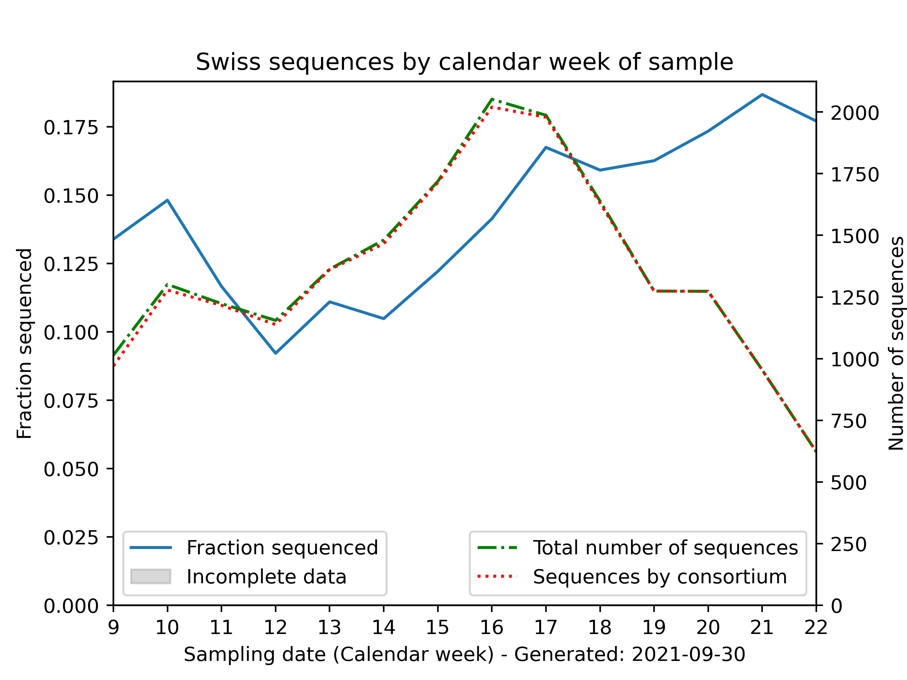
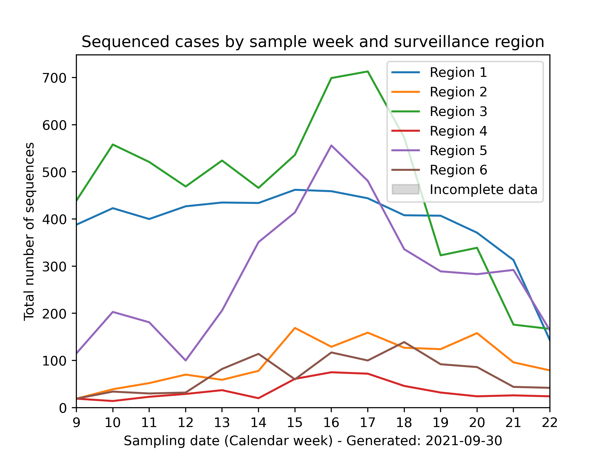
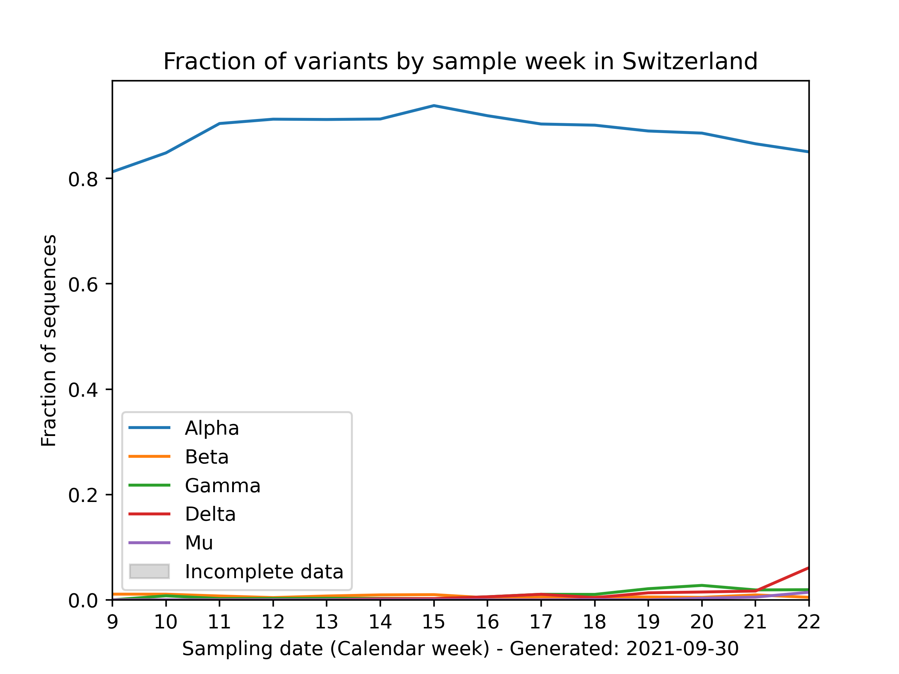
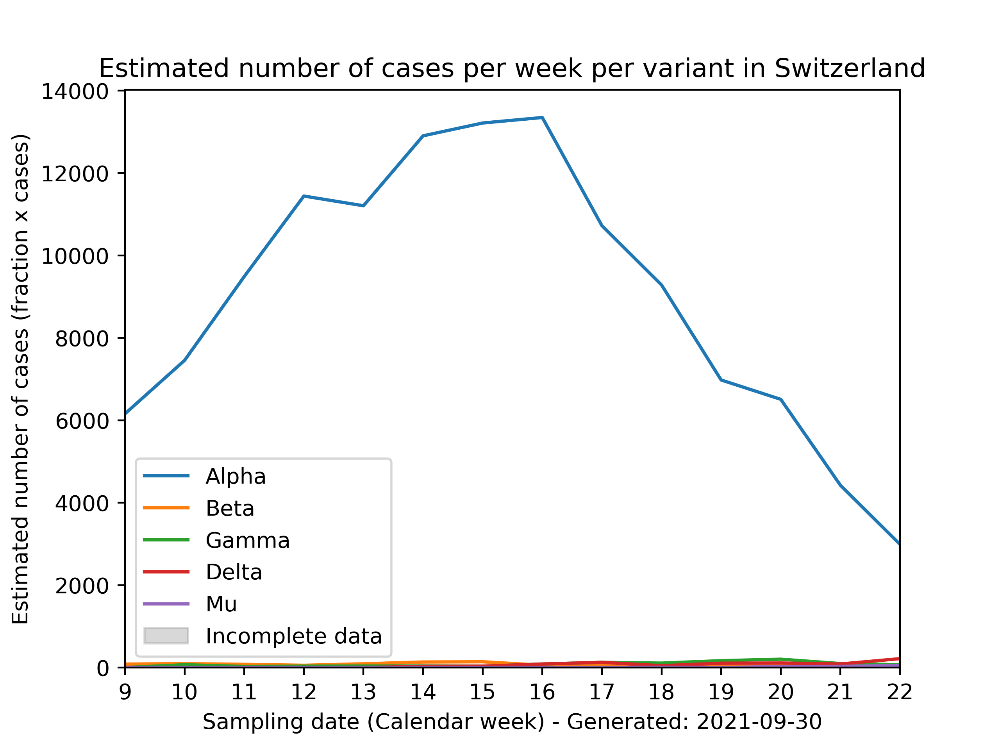
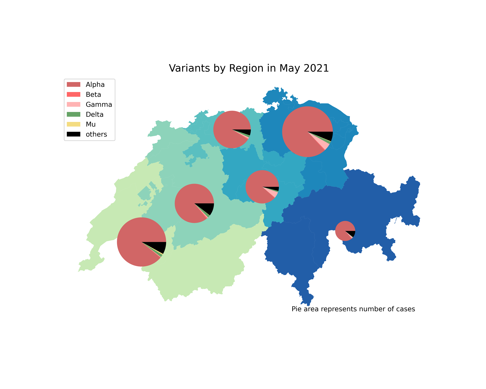

# Swiss national Sars-CoV-2 genomic surveillance program: Plots and Tables 

Command Line Interface program to create plots and tables for the monthly report of the Swiss national Sars-CoV-2 genomic surveillance program.

Sequencing data is obtained from covSpectrum's public API (for docs see https://github.com/cevo-public/cov-spectrum-docs/blob/develop/API.md)

Case data is obtained from the FOPH Covid data website's API: https://www.covid19.admin.ch/en/overview

Data is merged and binned by calendar week (beginning on Mondays). Data from cantons is aggregated to 6 Swiss Sentinella Surveillance Region:
```
Region 0: All of Switzerland (CH)
Region I: Genève (GE), Vaud (VD), Valais (VS) and Neuchâtel (NE)
Region II: Bern (BE), Fribourg (FR) and Jura (JU)
Region III: Basel-Stadt (BS), Basel-Land (BL), Aargau (AG) and Solothurn (SO)
Region IV: Luzern (LU), Zug (ZG), Nidwalden (NW), Obwalden (OW), Uri (UR), Schwyz (SZ) and Glarus (GL)
Region V: Zürich (ZH), Schaffhausen (SH), Thurgau (TG), St-Gallen (SG), Appenzell-Innerhoden (AI) and Appenzell-Ausserhoden (AR)
Region VI: Graubünden (GR), Ticino (TI) 
```

## Usage
```
usage: main.py [-h] [-d] [-p] [-t] [-s START_DATE] [-e END_DATE] [-o OUTPUT_DIR]

optional arguments:
  -h, --help            show this help message and exit
  -d, --download        download data, if unset, use stored data
  -p, --plot            create plots
  -t, --table           create tables
  -s START_DATE, --start-date START_DATE
                        start date - format YYYY-MM-DD
  -e END_DATE, --end-date END_DATE
                        end date - format YYYY-MM-DD
  -o OUTPUT_DIR, --output-dir OUTPUT_DIR
                        output sub-directory
```

Requirements (for precise versions see `requirements.txt`): 
- pandas
- matplotlib
- requests

Do fresh data download as follows:
```
./main.py --download
```

Create plots for May in folder `/plots/2021-05/` (plots are generated both in `png` and `pdf` formats in respective folders)
```
./main.py --plot --start-date 2021-04-01 --end-date 2021-06-07 --output-dir 2021-05 
```

Create table with all calendar weeks whose Monday occurs in May `/tables/2021-05/`:
```
./main.py --tables --start-date 2021-05-01 --end-date 2021-06-01 --output-dir 2021-05 
```

## Output (for May)







region  |  C.36*  |  beta  |  delta  |  gamma  |  others  |  sequences  |  cases  |  proportion_sequenced
--------|---------|--------|---------|---------|----------|-------------|---------|----------------------
0       |  87     |  27    |  104    |  89     |  5233    |  5540       |  34082  |  0.163
1       |  37     |  5     |  49     |  5      |  1500    |  1596       |  8724   |  0.183
2       |  3      |  3     |  8      |  5      |  529     |  548        |  5549   |  0.099
3       |  7      |  8     |  30     |  17     |  1499    |  1561       |  5081   |  0.307
4       |  0      |  1     |  2      |  3      |  138     |  144        |  4002   |  0.036
5       |  14     |  8     |  12     |  51     |  1173    |  1258       |  9278   |  0.136
6       |  24     |  2     |  2      |  8      |  359     |  395        |  1448   |  0.273

## Maintenance

Variant definitions are in `/scripts/variant_to_pango.py`

Region definitions in `/scripts/surveillance_region_map.py`

## Ground truth CSV definitions
All plots and tables are generated from a ground truth file placed in `data/cases_seq_by_cw_region.csv` that is generated by the program itself.

- **reg**: `int` for surveillance region, 0 stands for all of Switzerland
- **date**: Date of first day (= Monday) of respective calendar week
- **Beta,...**: Number of variants identified through sequencing
- **Others**: Any sequences that are not already accounted for in the named variant columns
- **Sequences**: Sum of all sequences
- **Cases**: Case count according to BAG dashboard